# Entity Relationship Diagram (ERD)

This is the complete schema mapping for all active models in the Cloud Mosaic platform, including the indexing structures, unique constraints, and relationships.

```mermaid
erDiagram
    User {
        int id PK
        string username
        string email
        string password
        boolean is_superuser
        boolean is_staff
    }

    ContactMessage {
        int id PK
        string full_name
        string company_name
        string email "Indexed"
        string phone "Indexed"
        string service
        string subject
        string message
        datetime created_at "Indexed"
    }

    NewsletterSubscription {
        int id PK
        string email "Unique, Indexed"
        boolean is_active "Indexed"
        datetime subscribed_at "Indexed"
    }

    Job {
        int id PK
        string title
        string department
        string location
        string description
        string requirements
        boolean is_active "Indexed"
        datetime created_at "Indexed"
    }

    JobApplication {
        int id PK
        int job_id FK "Indexed"
        string full_name
        string email "Indexed"
        string phone "Indexed"
        string linkedin
        string portfolio
        string cover_letter
        string reference_number "Unique, Indexed"
        string resume
        datetime applied_at "Indexed"
    }

    MeetingBooking {
        int id PK
        string full_name
        string email "Indexed"
        string phone "Indexed"
        string company
        string service
        date meeting_date "Indexed"
        time meeting_time "Indexed"
        string message
        string reference_number "Unique, Indexed"
        datetime created_at "Indexed"
    }

    Testimonial {
        int id PK
        string name
        string company
        string service
        int rating "Indexed"
        string review
        string status "Indexed"
        datetime created_at "Indexed"
    }

    FAQItem {
        int id PK
        string question
        string answer
        string category "Indexed"
        boolean is_active "Indexed"
        datetime created_at "Indexed"
    }

    Service {
        int id PK
        string name "Unique"
        string slug "Unique, Indexed"
        string description
        boolean is_active "Indexed"
        datetime created_at "Indexed"
    }

    EmployeeProfile {
        int id PK
        int user_id FK "Unique"
        string employee_id "Unique, Indexed"
        string department "Indexed"
        string designation
        date joining_date "Indexed"
        string phone
        date date_of_birth
        string address
        json skills
        json experience
        json education
        json emergency_contact
        string profile_image
    }

    Attendance {
        int id PK
        int employee_id FK "Indexed"
        date date "Indexed"
        time check_in
        time check_out
        decimal working_hours
        string status "Indexed"
    }

    LeaveRequest {
        int id PK
        int employee_id FK "Indexed"
        string leave_type "Indexed"
        date start_date
        date end_date
        string reason
        string status "Indexed"
    }

    Project {
        int id PK
        string name "Unique"
        string client
        string description
        date start_date
        date end_date
        string status "Indexed"
    }

    Task {
        int id PK
        int project_id FK "Indexed"
        int assigned_employee_id FK "Indexed"
        string title
        string description
        string priority "Indexed"
        date deadline
        string status "Indexed"
    }

    TaskComment {
        int id PK
        int task_id FK "Indexed"
        int user_id FK
        string comment
        datetime created_at "Indexed"
    }

    Timesheet {
        int id PK
        int employee_id FK "Indexed"
        int project_id FK "Indexed"
        int task_id FK "Indexed"
        date date "Indexed"
        decimal hours_worked
        string description
        string status "Indexed"
    }

    EmployeeDocument {
        int id PK
        int employee_id FK "Indexed"
        string document_type "Indexed"
        string file
        datetime uploaded_at "Indexed"
    }

    Notification {
        int id PK
        int user_id FK "Indexed"
        string title
        string message
        boolean is_read "Indexed"
        datetime created_at "Indexed"
    }

    EmployeeSettings {
        int id PK
        int user_id FK "Unique"
        json notification_preferences
        string profile_visibility
        json account_preferences
    }

    OTPVerification {
        int id PK
        int user_id FK "Indexed"
        string otp_code "Indexed"
        string purpose "Indexed"
        datetime expiry_time "Indexed"
        boolean verified_status "Indexed"
        int attempt_count
        datetime created_at
    }

    UserMFA {
        int id PK
        int user_id FK "Unique"
        string secret_key
        boolean enabled "Indexed"
        json backup_codes
        datetime created_at
    }

    ClientProfile {
        int id PK
        int user_id FK "Unique"
        string company_name
        string company_email "Indexed"
        string phone
        string website
        string industry "Indexed"
        string company_size
        string address
        string country
        string state
        string city
        string postal_code
        string contact_person
        boolean is_active "Indexed"
    }

    ClientProject {
        int id PK
        int client_id FK "Indexed"
        string project_name
        string description
        date start_date "Indexed"
        date end_date
        string status "Indexed"
    }

    ClientDocument {
        int id PK
        int client_id FK
        int project_id FK
        string title
        string document_type
        string file
        int uploaded_by_id FK
        datetime uploaded_at
        boolean is_visible
    }

    Contract {
        int id PK
        int client_id FK
        int project_id FK
        string contract_number "Unique, Indexed"
        string title
        date start_date
        date end_date
        decimal contract_value
        string status "Indexed"
    }

    Invoice {
        int id PK
        int client_id FK
        int project_id FK
        string invoice_number "Unique, Indexed"
        decimal amount
        date issue_date
        date due_date
        string status "Indexed"
    }

    Payment {
        int id PK
        int invoice_id FK
        string payment_reference "Unique, Indexed"
        decimal amount
        date payment_date
        string payment_method
        string status "Indexed"
    }

    ClientMeeting {
        int id PK
        int client_id FK
        string title
        date meeting_date
        time meeting_time
        string meeting_link
        string status "Indexed"
    }

    SupportTicket {
        int id PK
        int client_id FK
        string subject
        string description
        string priority "Indexed"
        string status "Indexed"
    }

    ClientSettings {
        int id PK
        int client_id FK "Unique"
        boolean notification_email
        boolean notification_sms
        string timezone
        string language
    }

    Job ||--o{ JobApplication : "has"
    User ||--|| EmployeeProfile : "has"
    User ||--o{ Attendance : "records"
    User ||--o{ LeaveRequest : "applies"
    User ||--o{ Timesheet : "logs"
    Project ||--o{ Timesheet : "contains"
    Project ||--o{ Task : "has"
    Task ||--o{ Timesheet : "tracks"
    User ||--o{ Task : "assignee"
    Task ||--o{ TaskComment : "has"
    User ||--o{ EmployeeDocument : "owns"
    User ||--o{ Notification : "receives"
    User ||--|| EmployeeSettings : "configures"
    User ||--o{ OTPVerification : "verifies"
    User ||--|| UserMFA : "configures"
    User ||--|| ClientProfile : "has"
    ClientProfile ||--o{ ClientProject : "has"
    ClientProfile ||--o{ ClientDocument : "owns"
    ClientProfile ||--o{ Contract : "signs"
    ClientProfile ||--o{ Invoice : "receives"
    Invoice ||--o{ Payment : "tracks"
    ClientProfile ||--o{ ClientMeeting : "schedules"
    ClientProfile ||--o{ SupportTicket : "raises"
    ClientProfile ||--|| ClientSettings : "configures"
```

## Database Design Highlights

### 1. Centralized Indexing Strategy
To optimize high-concurrency lookup performance, indexes are established on:
- Email fields (`ContactMessage`, `NewsletterSubscription`, `JobApplication`, `MeetingBooking`)
- Phone fields (`ContactMessage`, `JobApplication`, `MeetingBooking`)
- Status/Boolean fields (`NewsletterSubscription.is_active`, `Job.is_active`, `FAQItem.is_active`, `Testimonial.status`)
- Chronological timestamp fields (`created_at`, `applied_at`, `subscribed_at`)
- Specific unique reference strings (`MeetingBooking.reference_number`, `JobApplication.reference_number`)
- Employee fields (`EmployeeProfile.employee_id`, `EmployeeProfile.department`, `Attendance.date`, `LeaveRequest.leave_type`, `Timesheet.date`, `EmployeeDocument.document_type`, `Notification.is_read`)

### 2. Constraints Applied
- **Unique Constraints**:
  - `NewsletterSubscription.email`: enforces unique subscriptions.
  - `Service.slug` and `Service.name`: enforces unique service pages.
  - `Project.name`: enforces unique project name.
  - `EmployeeProfile.employee_id`: enforces unique employee ID sequence.
- **Composite Constraints**:
  - `unique_meeting_booking`: `meeting_date` + `meeting_time` on `MeetingBooking` model (enforces slot booking limits).
  - `unique_job_application`: `job` + `email` on `JobApplication` (enforces single application submission constraint).
  - `unique_attendance_date`: `employee` + `date` on `Attendance` (enforces single check-in transaction record per day).
- **Check Constraints**:
  - `testimonial_rating_range`: Enforces that testimonial star ratings must reside strictly between `1` and `5` in the database engine.

### 3. Field-Level Encryption At Rest
To safeguard PII and credentials, symmetric encryption using cryptography Fernet keys (with key material dynamically derived from `settings.SECRET_KEY`) is applied to:
- `EmployeeProfile.phone` (EncryptedCharField)
- `EmployeeProfile.address` (EncryptedCharField)
- `EmployeeProfile.emergency_contact` (EncryptedJSONField)
- `UserMFA.secret_key` (EncryptedCharField)

